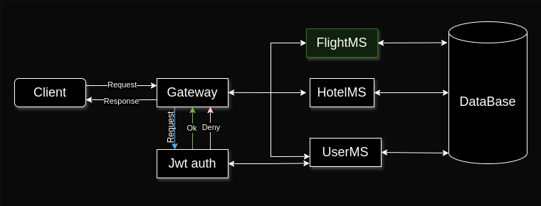

# L-Airline API Rest Project: Flight Microservice.

This microservice management the Flight module: persistence and data retrieve.

## Flight
Have the following data: id, airlineName, origin, destiny, flightSchedule, layover, price.

## Exception Handling
Create custom exceptions and handle all exceptions than the project can throw (or I know that can throw), and use the ResponseEntity interface to return a friendly, understandable and explicit message.