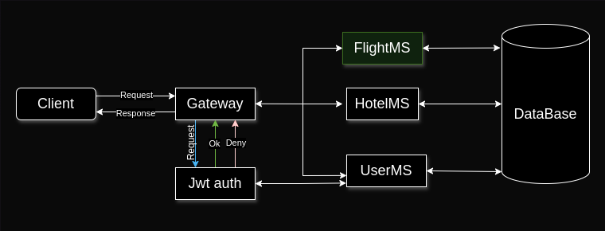

## Technologies used:
- Java 21
- Neo4j
- Spring
- Hashicorp Vault

# L-Airline API Rest Project: Flight Microservice.

The Flight microservice manages flight tickets within the airline system.
Registers are stored in a Neo4j database,
representing a specific flight with details about its route, schedule,
pricing, and related entities such as airports and airplanes.


# Ticket Node Structure

The Ticket class is modeled as a flight_ticket node in the Neo4j database. It contains essential attributes and relationships to define a flight ticket.

## Attributes

- **id** (UUID): Unique identifier for the flight ticket.
- **origin** (City): The departure city of the flight.
- **destiny** (City): The destination city of the flight.
- **seat** (int): The seat number assigned to the passenger.
- **price** (double): The cost of the ticket. **(deep explaining later)**
- **schedule** (LocalDateTime): The scheduled departure time of the flight.
- **airlineName** (AirlineName): The airline operating the flight.
- **airplaneID** (UUID): Identifier for the airplane used in the flight.
- **originAirportID** (UUID): Identifier for the origin airport.
- **destinyAirportID** (UUID): Identifier for the destination airport.

## Relationships
- **airplane** (Airplane) - fly_in (OUTGOING): Indicates the airplane used for the flight.
- **originAirport** (Airport) - origin_airport (INCOMING): Represents the departure airport.
- **destinyAirport** (Airport) - destiny_airport (OUTGOING): Represents the destination airport.

## Price setting
PriceGenerator class is responsible to get the origin and destiny airports coordinates. Using the Haversine Formula, it calculates the distances between origin and destiny, setting a price by distance.

With the following formula:


I created this method:
```java
public static double calc(String originLatitude, String originLongitude, String destinyLatitude, String destinyLongitude) {
    int earthRadio = 6371;
    //Parse to int from a String the origin latitude data
    //...
    //Parse to int from a String the origin longitude data
    //...
    
    //Parse to int from a String the destiny latitude data
    //...
    //Parse to int from a String the destiny longitude data
    //...

    //Parse to grades latitude and longitude received data
    double originLatitudeGrades = originLatitudeToGrades + originLatitudeToMinutes / 60 + originLatitudeToSeconds / (60 * 60);
    double originLongitudeGrades = originLongitudeToGrades + originLongitudeToMinutes / 60 + originLongitudeToSeconds / (60 * 60);
    double destinyLatitudeGrades = destinyLatitudeToGrades + destinyLatitudeToMinutes / 60 + destinyLatitudeToSeconds / (60 * 60);
    double destinyLongitudeGrades = destinyLongitudeToGrades + destinyLongitudeToMinutes / 60 + destinyLongitudeToSeconds / (60 * 60);

    //If any coordinate comes from South or West; set negative value
    if (originLatitude.endsWith("S")) {
        originLatitudeGrades = originLatitudeGrades * (-1);
    }
    if (originLongitude.endsWith("O")) {
        originLongitudeGrades = originLongitudeGrades * (-1);
    }
    if (destinyLatitude.endsWith("S")) {
        destinyLatitudeGrades = destinyLatitudeGrades * (-1);
    }
    if (destinyLongitude.endsWith("O")) {
        destinyLongitudeGrades = destinyLongitudeGrades * (-1);
    }

    //Parse from grades to radians
    //...
    
    //Latitude's and longitude's differences
    double latitudeDif = originLatitudeRadians - destinyLatitudeRadians;
    double longitudeDif = originLongitudeRadians - destinyLongitudeRadians;

    //sin²(latitudeDif)
    double sin2A = (1 - Math.cos(latitudeDif)) / 2;
    //sin²(longitudeDif)
    double sin2B = (1 - Math.cos(longitudeDif)) / 2;
    double cosOriginLatitude = Math.cos(originLatitudeRadians);
    double cosDestinyLatitude = Math.cos(destinyLatitudeRadians);

    //√(sin²(latitudeDif) + cos(originLatitudeRadians) * cos(destinyLatitudeRadians) * sin²(longitudeDif))
    double squareRoot = Math.sqrt(sin2A + cosOriginLatitude * cosDestinyLatitude * sin2B);

    double squareRootArcsin = Math.asin(squareRoot);

    double distance = 2 * earthRadio * squareRootArcsin;

    //Other's ifs that setts distinct prices
    if (distance > x) {
        return x1;
    }

    //Return 500 if distance < 1000 km
    return 500;
}
```
---
# Airport Node Structure
 It represents an airport with geographical and identifying information.

# Attributes
- **id** (UUID): Unique identifier for the airport.
- **name** (String): The name of the airport.
- **latitude** (String): Latitude coordinate of the airport.
- **longitude** (String): Longitude coordinate of the airport.
- **city** (City): The city where the airport is located.

----

# Airplane Node Structure
It represents an aircraft used for flights, containing details about its capabilities and airline ownership.

# Attributes
- **id** (UUID): Unique identifier for the airplane.
- **name** (AirplaneName): The name of the airplane model.
- **airlineName** (AirlineName): The airline operating the airplane.
- **capacity** (int): Maximum number of passengers the airplane can carry.
- **tank** (int): The fuel tank capacity of the airplane.
- **maxKmDistance** (int): The maximum distance the airplane can travel without refueling.

## Exception Handling
Create custom exceptions and handle all exceptions than the project can throw (or I know that can throw), and use the ResponseEntity interface to return a friendly, understandable and explicit message.